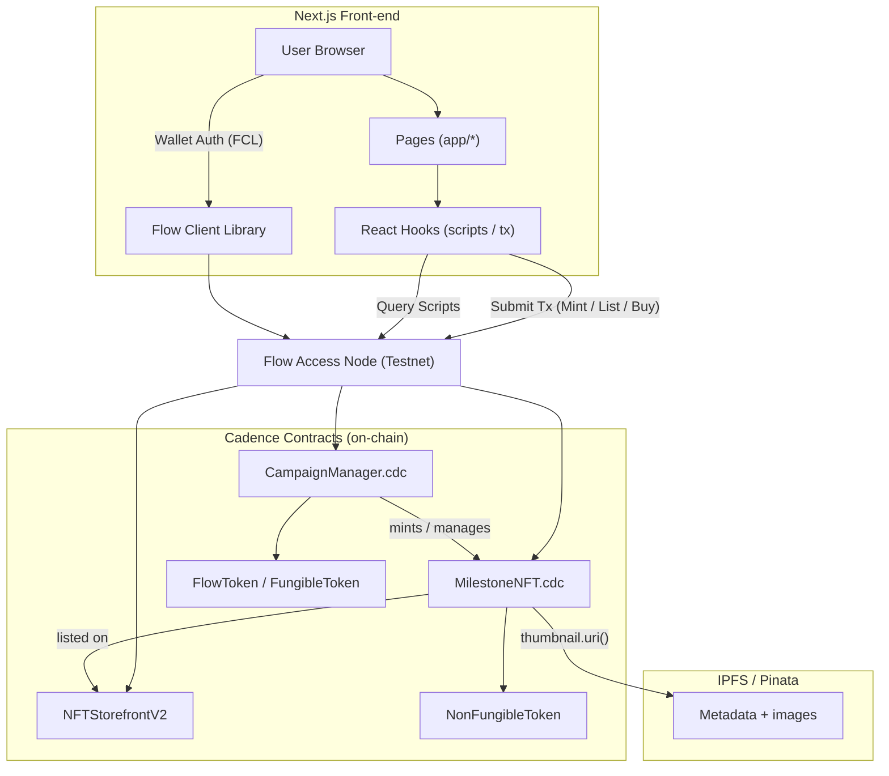
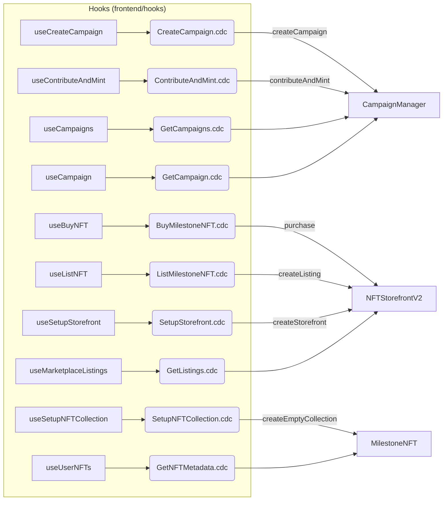

# FanFuel – Crowdfund & Reward Creators with Flow NFTs

**FanFuel** empowers creators to launch **milestone-driven NFT campaigns**—where they not only raise funds but  **also earn royalties on every future resale** through Flow’s powerful [`NFTStorefrontV2`](https://developers.flow.com/build/core-contracts/nft-storefront). Creators can also offer **exclusive perks and loyalty rewards** to NFT-holding fans, turning early backers into long-term supporters and community champions.


---

## ⚙️ How we integrate with Flow

| Layer     | Contract / Resource     | What it does                                                      |
| --------- | ----------------------- | ----------------------------------------------------------------- |
| Cadence   | **MilestoneNFT.cdc**    | Custom NFT that stores image/metadata for each project milestone  |
| Cadence   | **CampaignManager.cdc** | Manages campaigns, contributions and milestone unlocks            |
| Flow Core | **NFTStorefrontV2**     | Secondary-market sales; we rely on its built-in royalty engine    |
| Front-end | Next.js + FCL           | Wallet auth, scripts & transactions (mint, contribute, list, buy) |

---

## 💰 How These NFTs Create Value

### 🎨 For Creators  
- Mint **milestone NFTs** as digital collectibles tied to specific funding goals.  
- Earn automatic **royalties on every resale** via [`NFTStorefrontV2`](https://developers.flow.com/build/core-contracts/nft-storefront)—no custom logic needed.  
- Future-proof engagement: gate Discord channels, unlock merch, or build **loyalty rewards** for NFT holders.

### 🙌 For Fans / Backers  
- Own a **provable on-chain badge** that shows you backed the project.  
- Trade NFTs on open marketplaces—**creators still earn royalties** on resales.  
- Get rewarded as early adopters through perks or exclusive access in the creator’s growing world.

### 🛍️ For Collectors / Buyers  
- **One-click purchases** using any Flow-compatible wallet.  
- Transparent price and expiry pulled **directly from the blockchain**.  
- Tap into a growing **secondary market** with baked-in, trustless royalty support.

---

## 🔗 Demo contracts & accounts

| Role               | Testnet Address      | Explorer Links                                                                                                                                                  |
| ------------------ | -------------------- | --------------------------------------------------------------------------------------------------------------------------------------------------------------- |
| Campaign Creator (or deployer) | `0xa474cefca3cbc541` | [Deployer](https://testnet.flowscan.io/account/a474cefca3cbc541) · [CampaignManager](https://contractbrowser.com/A.a474cefca3cbc541.CampaignManager) · [MilestoneNFT](https://contractbrowser.com/A.a474cefca3cbc541.MilestoneNFT) | 
| Fan / Backer       | `0xb220abcf3acfcf20` |   [Fan](https://testnet.flowscan.io/account/b220abcf3acfcf20)                                                                                                                                            |
| Buyer / Collector  | `0x564712122b35cfff` | [Buyer](https://testnet.flowscan.io/account/564712122b35cfff)                                                                                                 | 

Watch the full flow in action in our demo video → [YouTube](https://www.youtube.com/watch?v=zBuIca5tBTk).

---

## 👥 Team

| Name        | Role                 | Twitter                                           | Telegram         |
| ----------- | -------------------- | ------------------------------------------------- | --------------- |
| Dharshan    | Full-stack / Cadence | [dharshan_tw](https://x.com/dharshan_tw)         | [capGoblin](https://t.me/capGoblin)|
| Raaghav | Full-stack / Cadence             | [Raaghav_manivel](https://x.com/Raaghav_manivel)  | [RaaghavManivel](https://t.me/RaaghavManivel)|

---

# FanFuel – System Architecture



### Legend

- **User Browser** – React UI served by Next.js.
- **Flow Client Library (FCL)** – Handles wallet discovery & signing.
- **React Hooks** – Thin wrappers calling Cadence scripts / transactions.
- **Flow Access Node** – gRPC endpoint at `https://access-testnet.onflow.org`.
- **CampaignManager.cdc** – Creates campaigns & triggers NFT mints.
- **MilestoneNFT.cdc** – Resource-oriented NFT contract.
- **NFTStorefrontV2** – Core marketplace contract for listings & royalties.
- **IPFS / Pinata** – Off-chain storage for images & JSON metadata referenced via URI.

This diagram shows the full request flow from a button click in the browser down to Cadence execution on-chain and back, including how images are resolved off-chain.

---

## 🔄 Contract interactions (hooks → Cadence transactions / scripts)



This view maps every React hook to the Cadence **transaction** or **script** it runs and then to the **on-chain contract function** it touches.

--- 

## 🚀 Quick start

```bash
# 1. Install deps
bun i  # or npm install

# 2. (Optional) Re-deploy contracts – use the **creator account** (`0xa474cefca3cbc541`)
flow deploy --network testnet

# 3. Run the web app
bun dev  # or npm run dev
```

The dApp connects to `https://access-testnet.onflow.org` by default. Update addresses in `frontend/providers/FlowProvider.tsx` if you redeploy.

---

## 📄 License

MIT – do whatever you want, just give us a shout-out.

---
